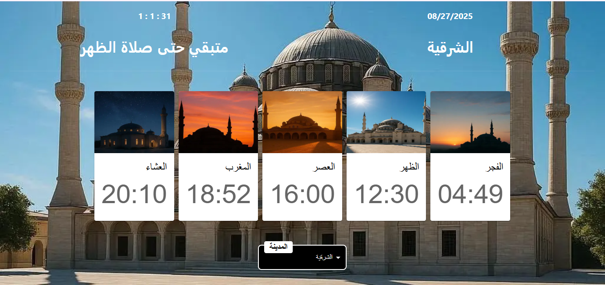

# 🕌 Prayer Times

A **React** web application built with **Vite** and styled using **Material UI (MUI)**.  
The app displays **Islamic prayer times** for different cities in Egypt in a clean and responsive interface.

## 🌐 Website Screenshot



---

## 🚀 Features
- ✅ Display daily Islamic prayer times (Fajr, Dhuhr, Asr, Maghrib, Isha)  
- ✅ Countdown timer to the next prayer  
- ✅ Select your city from a dropdown menu  
- ✅ Built with **React + Vite** for fast performance  
- ✅ Modern and responsive design using **Material UI**  

---


## 🛠️ Technologies Used
- **React** – Frontend library for building UI  
- **Vite** – Fast development and build tool  
- **Material UI (MUI)** – React components and styling  
- **Axios** – Fetching prayer times from API  
- **Moment.js** – Time formatting and countdown  
- **JavaScript (ES6+)** – Logic and functionality  

---


## 📂 Project Structure

```text
prayer-times/
├── public/
│   ├── images/
│   │   ├── background.webp
│   │   ├── Fajr.webp
│   │   ├── Dhuhr.webp
│   │   ├── Asr.webp
│   │   ├── Maghrib.webp
│   │   ├── Isha.webp
│   │   └── Website.png
│   └── index.html
├── src/
│   ├── components/
│   │   ├── PrayerCard.jsx
│   │   └── MainContent.jsx
│   ├── App.jsx
│   ├── main.jsx
│   └── App.css
├── package.json
├── vite.config.js
└── README.md
```


## ⚙️ Installation & Setup

1. Clone the repository:

```bash
git clone https://github.com/ahmedtalaat-dev/prayer-times.git
```

2. Navigate into the project folder:

```bash
cd prayer-times
```

3. Install dependencies:

```bash
npm install
```

4. Run the development server:

```bash
npm run dev
```

## 📌 Usage

- Open the link provided by the development server in your browser.

- The interface displays daily prayer times.

- Use the city dropdown menu to select your city.

- The countdown timer updates automatically to show the next prayer.

- Enjoy the prayer cards with images for each prayer.


## 🌐 Live Website

You can view the deployed website here:  

[Prayer Times Website](https://prayer-times-egypt.netlify.app/)
